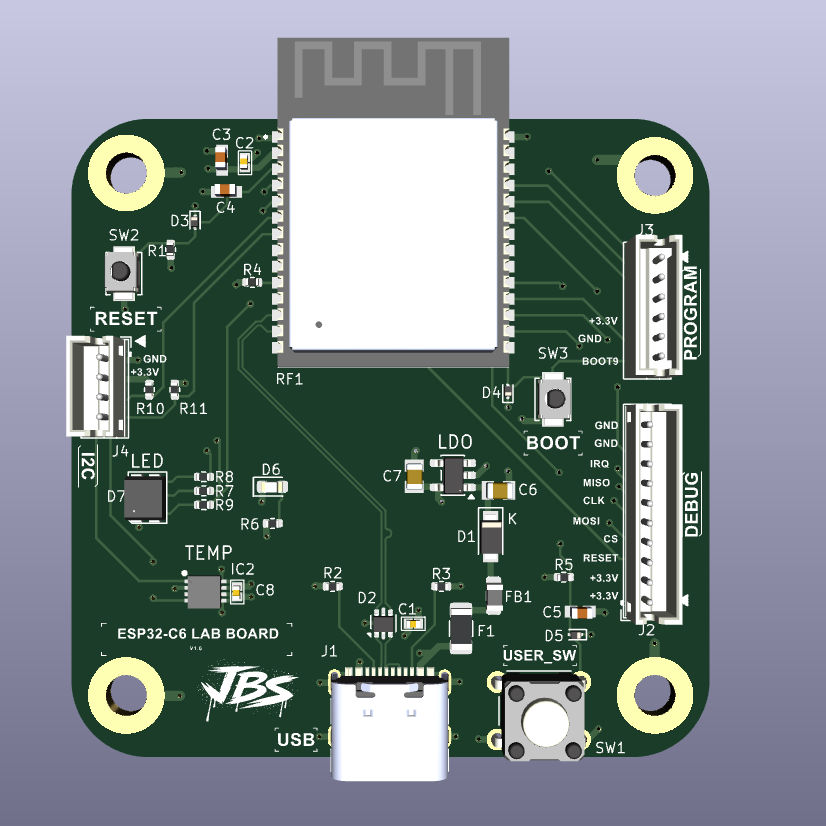
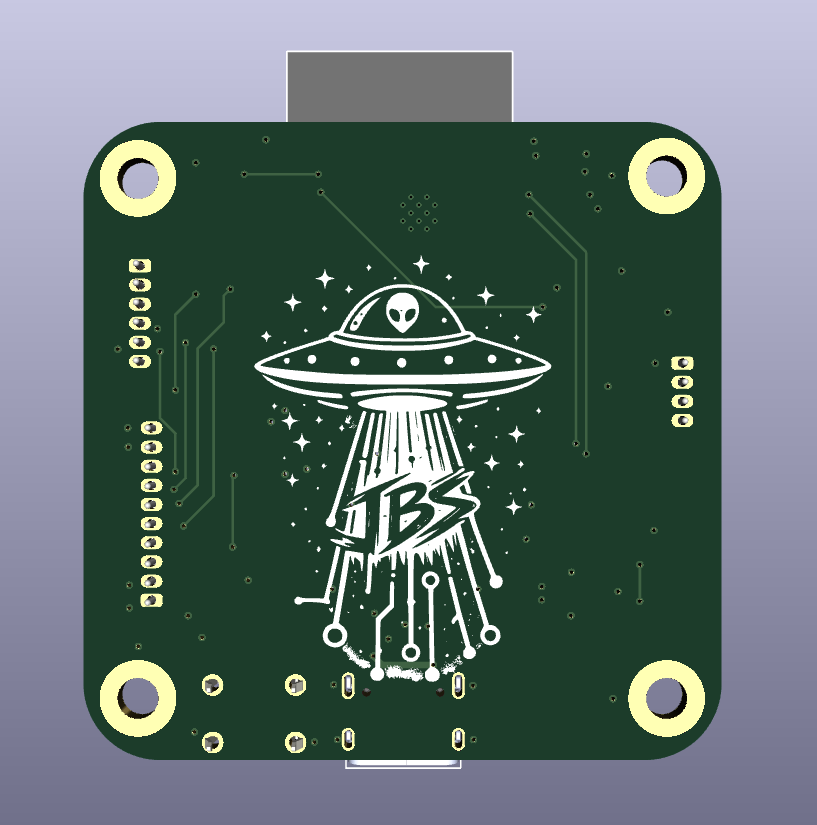

# ESP32-C6_MICROCONTROLLER

<p align="center">
  
</p>

<p align="center">
  
</p>

Custom ESP32-C6 development board with USB-C power, RGB status LED, user input, I2C expansion, OLED support, UART programming access, and onboard temperature/humidity sensing.

This board is a small ESP32-C6 bring-up and sensor demo platform. It was designed to verify core power, boot/programming flow, GPIO, RGB LED control, I2C device detection, OLED output, and live environmental sensor readings.

## Project Status

Bring-up demo verified.

The board has successfully run a combined test with:

- RGB LED control
- User button input
- I2C bus scan
- OLED output
- Live temperature/humidity readout
- UART programming through the J3 program header

## Demo Features

- ESP32-C6 microcontroller core
- USB-C power input
- 3.3V regulation
- RGB status LED
- User button
- I2C expansion header
- OLED display support
- Onboard temperature/humidity sensor
- UART programming/debug header
- Reset and boot control for bring-up

## System Role

```text
USB-C / bench power
        ↓
ESP32-C6_MICROCONTROLLER
        ↓ I2C
OLED display + temp/humidity sensor
        ↓
bring-up demo / serial debug output
```

## Key Specs

| Item | Value |
|---|---|
| MCU | ESP32-C6 |
| Main rail | +3.3V |
| Power input | USB-C |
| Programming path verified | UART through J3 program header |
| Display interface | I2C OLED |
| Sensor interface | I2C temp/humidity sensor |
| OLED address | `0x3C` |
| Temp/humidity sensor address | `0x44` |
| RGB LED behavior | Active-low |
| Board role | ESP32-C6 bring-up/demo board |

## Verified Working

- USB-C power input
- 3.3V regulation
- ESP32-C6 boot from flash
- UART programming through J3
- Reset button
- Boot button/manual boot sequence
- User button
- RGB LED
- I2C bus
- OLED display at `0x3C`
- Temperature/humidity sensor at `0x44`

## Verified GPIO Map

| GPIO | Function |
|---:|---|
| GPIO3 | RGB red |
| GPIO4 | RGB green |
| GPIO5 | RGB blue |
| GPIO23 | User switch |
| GPIO6 | I2C SDA |
| GPIO7 | I2C SCL |

## RGB LED Notes

The RGB LED is active-low.

```text
GPIO LOW  → LED color ON
GPIO HIGH → LED color OFF
```

Firmware should invert the LED logic when controlling the status LED.

## I2C Devices

The following I2C devices were detected during bring-up:

| Address | Device |
|---:|---|
| `0x3C` | OLED display |
| `0x44` | Temperature/humidity sensor |

## Sample Verified Sensor Reading

Example live reading from bring-up:

```text
Temperature: 29.2 C
Humidity:    35.0 %RH
```

## UART Programming Notes

UART programming through the **J3 program header** is working.

Working connections:

| USB-UART adapter | ESP32-C6 board |
|---|---|
| TX | ESP_RXD |
| RX | ESP_TXD |
| GND | GND |

## Manual Upload Sequence

Current working upload sequence:

1. Hold **BOOT**.
2. Start upload.
3. Tap **RESET** when the tool begins connecting.
4. Release **BOOT** after connection.
5. Press **RESET** after upload to run the application.

## Native USB Status

Native USB enumeration still needs separate debug and validation.

Current programming flow uses UART through the J3 program header.

## Bring-Up Checklist

1. Inspect USB-C and regulator soldering.
2. Power from USB-C and confirm +3.3V.
3. Connect USB-UART adapter to J3.
4. Use the manual BOOT/RESET upload sequence.
5. Verify boot from flash.
6. Run I2C scanner.
7. Confirm OLED at `0x3C`.
8. Confirm temp/humidity sensor at `0x44`.
9. Verify RGB LED channels.
10. Verify user button input.
11. Run combined OLED + sensor + LED demo.

## Open Items

- Validate native USB enumeration.
- Improve programming flow beyond manual UART boot sequence.
- Add screenshots/photos of OLED and sensor demo.
- Add firmware example to the repository.

## Repository Output Images

Expected image paths for GitHub README rendering:

```text
Outputs/
  IMG/
    3D-T.png
    3D-B.png
    SCHEMATIC.png
    L1-SIG.png
    L2-GND.png
```

## Safety / Design Note

ESP32-C6_MICROCONTROLLER is a low-voltage development board. Verify regulator output, USB wiring, and UART adapter voltage level before connecting external hardware.

Designed & engineered by Brandon Shelly.